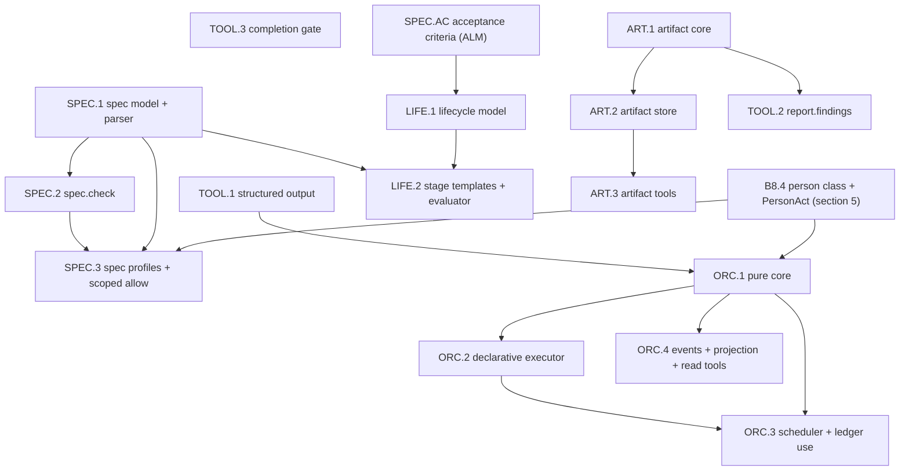

# Planning, lifecycle, orchestration and artifacts for the native harness — the first cut

**Status: DRAFT for the leader's filing. No item exists on the board for anything new here.**
Written 2026-09-28 from the harness-web research (`docs/superpowers/research/2026-09-28-harness-web/`,
cited below as `[A]`..`[G]`; `[G]` is the consolidated filing list and the authority for item ids).
This spec turns designs `[E]` (spec-driven plan mode and lifecycle stages) and `[F]` (native
orchestration and native artifacts) into a buildable FIRST CUT. It **extends** the catalogue spec
(`2026-09-28-runtime-b8-catalogue.md`, "B8") and never duplicates it: where B8 already decides a
thing, this spec points at the section and adds only the delta.

Markers: **[LEADER]** the leader's final decision of 2026-09-28 (session 799353fdf9); **[OWNER]**
a decision already on record; **[OWNER PENDING]** a question only the owner may answer;
**[PROPOSED]** this spec's own proposal, open to the leader; **[UNVERIFIED]** a claim this spec
could not check against code and which the implementer must check first.

**Placement.** Post-M1, like B8 [LEADER]. Nothing here changes the agreed order (finish B4, UI.2,
UI.3, UI.6; release; the owner tests a native session; then new work).

---

## 1. What this spec is and is not

**It is:** the detailed specification of 16 first-cut items (TOOL.1-3, SPEC.AC + SPEC.1-3, LIFE.1-2,
ORC.1-4, ART.1-3), a dependency graph and build order, the invariants that carry the owner's
orchestration lesson, the 18 scope extensions to items already on the board, and a table of every
other item of `[G]` §3 waiting for the owner's answers.

**It is not:**

- **The visual design.** UI.6 and the Harness TUI board (P1-P5) own layout and keys. Surfaces are
  named here only as "later items" that consume the shapes this spec fixes.
- **A launchable orchestration.** The first cut builds the engine and its projection. **Nothing in
  it can be started by a person or a model**; the launch card and the `PersonAct` minting are ORC.10
  (Later). The first cut is therefore incapable of spending money by construction, and the tests run
  it over a fake `AgentRunner` (see ORC.3).
- **A script language.** Orchestrations are DECLARATIVE in the first cut [LEADER]. A free script
  engine is an owner decision (section 7) and nothing here depends on it.
- **A hosted anything.** No public link, no cloud fleet, no publish (section 10) [OWNER, D10].

The runtime/host split follows D23 [OWNER]: pure rules and formats in `packages/runtime`, every file
read, write, route and journal append in the host (`packages/server`). `packages/runtime` NEVER
imports server/web (`runtime-boundary.lint.test.ts`).

---

## 2. Decisions this spec takes, and those it leaves open

| # | Decision | Status |
|---|---|---|
| P1 | **The ALM acceptance-criteria gap is real** (`[G]` OTH.1: no `AcceptanceCriterion` on the board; master spec section 26 describes it, nothing files it). Filed here as **SPEC.AC**, the first item of the SPEC group. **LIFE.1 and SPEC.10 depend on it** | [LEADER] |
| P2 | **The person-only permission class is accepted as part of B8.4**, under the value **`person`** (P8). It holds under all three B4.7 built-in profiles (#744); the acceptance test is the plan-profile-bypass test's shape, over a table (section 5) | [LEADER] |
| P3 | **Orchestrations start DECLARATIVE**: a typed JSON pipeline of steps, no new JS or WASM dependency. `[G]` ORC.2 "WASM interpreter" becomes "declarative pipeline executor". The free script engine is a numbered owner decision (N1, section 7) and **nothing depends on it** | [LEADER] |
| P4 | **First cut = TOOL.1-3, SPEC.1-3 + SPEC.AC, LIFE.1-2, ORC.1-4, ART.1-3, in full.** Every other item of `[G]` §3 is a row in section 8 | [LEADER] |
| P5 | **Order: TOOL.1 plus `person` first, then SPEC, then ORC; LIFE and ART after or alongside as dependencies allow** (graph in section 4) | [LEADER] |
| P6 | **The spec-artifact root is GENERIC**: a setting with a neutral default (`docs/specs/<slug>/`). Agentistics configures its own (`docs/superpowers/specs/`). The runtime embeds no host-specific fact (D23) | [LEADER] |
| P7 | **B9.1 and B9.2 are todo; only B9.3 and H18 are done.** Items that lean on effort or image input (role `effort`, LIFE.9, ART.10) are stated as blocked on the todo items | [LEADER] |
| P8 | **DECIDED: the person-only class is a NEW value, `person`, beside the shipped `gated`.** `gated` already exists with a different meaning: `packages/runtime/src/tools/contract.ts:95` `ToolPermission = 'auto' \| 'ask' \| 'gated'`, deny by default and OVERRIDABLE through `PolicyOptions.defaults` (`policy/policy.ts:91`). **`gated` keeps its shipped meaning; nothing is renamed or migrated.** For `person`: no rule, no profile and no `defaults` entry can release it; only a person's answer at the prompt does. Verified by the leader on `origin/dev` | [LEADER] |
| P9 | The declarative manifest carries `kind: "pipeline"` and a `schemaVersion`, so a future `kind: "script"` can be added without breaking a stored manifest. An unknown `kind` is REFUSED, never treated as a pipeline | [PROPOSED] |
| P10 | Unattended orchestrated agent hitting an `ask`: **deny with a sentence** in the first cut. Card pre-grants and "park as needs-you" are ORC.16 (Later). Matches the recommendation of `[G]` Q17 | [PROPOSED], owner pending (Q17) |
| P11 | `waived` (a criterion state, LIFE.1) is settable only through a person-origin write. The MCP door refuses it (422 `waive_person_only`) | [PROPOSED] |

---

## 3. The orchestration lesson, and the invariants that carry it

The owner lost money to an orchestration the MODEL launched on its own, with the most expensive
model INHERITED from the session `[F]` A.1 point 3. The reference product lets a typed keyword start
planning automatically and lets "Always" pre-approve `[F]`, `[B:F73, F76]`. Six invariants, each
with a test and each enforced in code, not in a prompt:

| # | Invariant | Where it is enforced in the first cut |
|---|---|---|
| I1 | **A run is never launched by the model.** There is no tool that launches. `orchestration.status` and `orchestration.result` are read-only. The runtime's only entry, `run(plan, act)`, requires a `PersonAct` value that only the host can mint from a person input event | ORC.1 (the type), ORC.4 (read-only tools); the minting is ORC.10 |
| I2 | **No keyword, mode switch or prompt text starts a run.** "ultracode" typed in a prompt does nothing; it names a SURFACE label, not a trigger | Test over `packages/runtime` and the host's prompt path: no code branches on orchestration names or the word |
| I3 | **A cost estimate is shown before launch, with its basis.** Low / likely / high from measured figures, or "no measured basis" plus only the maximum the ceilings allow. Never rendered as a fact | ORC.1 (arithmetic); the card is ORC.10 |
| I4 | **Every role's model is explicit.** The manifest names roles and NO model; models are bound at launch. `inherit` / `same as session` is not a value. A manifest naming a model is refused by the static check | ORC.1 |
| I5 | **Hard ceilings are mandatory**: `maxUSD`, `maxTokens` (optional when priceable), `maxAgents`, `maxWallClock`, `concurrency`. No "unlimited". A plan without every ceiling does not pass `check` | ORC.1, ORC.3 |
| I6 | **No "Always allow" on an orchestration and no remembered consent.** A trusted script hash (B8 section 4) is a reading concept and never carries a spending grant | ORC.1 (`PersonAct` is single-use: bound to one plan hash and one ceiling set) |

Related, from `[F]` A.2.6: a ceiling is enforced by RESERVING each agent's worst case before it
starts and settling to the exact journal figure after; the stated overshoot is one in-flight billed
response, and the estimate shows that figure instead of claiming zero.

---

## 4. Build order and dependency graph

Order of work [LEADER]:

1. **Wave 0**: the `person` class and `PersonAct` (section 5), with **TOOL.1**. TOOL.3 is independent and may run beside them.
2. **Wave 1 (SPEC)**: SPEC.AC (server, independent of the runtime, may start at wave 0), then SPEC.1 -> SPEC.2 -> SPEC.3.
3. **Wave 2 (ORC)**: ORC.1 -> ORC.2 and ORC.3 -> ORC.4.
4. **Alongside, as dependencies allow**: LIFE.1 (after SPEC.AC) -> LIFE.2 (after SPEC.1); ART.1 -> ART.2 -> ART.3 (needs only the journal and B4.6, so it can start in wave 1); TOOL.2 after ART.1.

The only cross-group hard edges are: SPEC.AC -> LIFE.1, `person` -> SPEC.3 and ORC.1, TOOL.1 -> ORC.1, SPEC.1 -> LIFE.2. ART has no edge into SPEC/LIFE/ORC in the first cut (evidence ART.6 and report artifacts ORC.9 are Later).

---

## 5. Foundation: the `person` class and `PersonAct` (an extension of B8.4)

B8 section 5.5 defines the permission profiles and B3 section 3 the classes `auto` / `ask` / `gated`.
This section is the delta. Naming reconciliation: P8.

### 5.1 What it adds

- **A fourth value on the shipped `ToolPermission` (`contract.ts:95`): `person`** (P8). The shipped `gated` stays exactly as it is.
  The `person` class means: only a
  person can release the call, per call; no allow-for-session, no prefix approval, no rule of any
  layer releases it; the releasing actor is recorded.
- **`PersonAct`** (pure type in `packages/runtime/src/policy/`): the single proof that a person did
  something. `{ actor: 'person', surface: 'web'|'tui'|'vscode'|'cli', at, bindsTo: <sha256 of the
  call or plan being released> }`. The host mints it from a person input event on a surface. No
  runtime code constructs one; the type is opaque (branded) so a fixture cannot forge it outside
  tests. It is **single-use and bound to one call hash** (I6). ORC.10's `PersonConfirmation` and this
  release are the same type, so there is one mechanism, not two.
- **Loader refusal.** A `rules` entry of effect `allow` whose subject is a person-class tool is refused at
  load in words, in every layer, exactly as B8 refuses a rule that targets a floor subject.
- **Events**: `policy.person.requested{tool, callHash}`, `policy.person.released{tool, callHash, actor, surface}`, `policy.person.refused{tool, callHash, reason}`. Facts only, no arguments copied (D5).
- **Headless and unattended**: a person-class call with no person available is REFUSED, never waited on
  (H16 non-interactive mode; orchestrated agents, P10).

### 5.2 Lives in

Pure: `packages/runtime/src/policy/` (class, evaluator branch, `PersonAct`, loader validation).
Host: the surface handlers that mint `PersonAct` (web card, TUI, VS Code, CLI: one host handler,
four doors, the `task-reopen.ts` rule).

### 5.3 Dependencies

B4.7 (the three profiles, board item #744, in progress), B8.4 (layers). Extends B8.4's scope (section 9, row 2).

### 5.4 Acceptance criteria

1. **The bypass table.** A generated test enumerates:
   - every built-in B4.7 profile (`default`, `plan`, `accept-edits`; #744);
   - every rule-layer POSITION (`PolicyLayer.name` is free text and only the order counts,
     `rules.ts:60`);
   - every allow kind: exact allow rule, prefix allow, glob/path allow, allow-for-session,
     remembered approval, allow-once from a non-person actor, a trusted-project grant, and **the
     policy's `defaults` setting the `person` class to `'allow'`** (`PolicyOptions.defaults`,
     `policy.ts:91`: the shipped `gated` accepts that row, `person` must refuse it).

   Each cell attempts to release a fixture person-class call. **Every cell is refused.** The test is
   built the way B4.7 tested the plan-profile bypass, and it fails the build when a profile, a layer
   position or an allow kind is added without a row.
2. A person-class call is released by exactly one path: a `PersonAct` bound to that call's hash. A
   `PersonAct` for call X cannot release call Y; a used one cannot release again.
3. `policy.person.released` carries the actor and surface; a release without an actor is impossible
   to express (type test).
4. The loader refuses an `allow` rule targeting a person-class tool in every layer, with a file:line
   sentence; the same rule as a `deny` or `ask` is accepted (it only narrows).
5. Under `plan`, a person-class call still asks a person and is never auto-denied into a silent no-op: the
   refusal names the reason.
6. The deny floor is unchanged: no person-class release lifts it (test over every floor subject).
7. A fixture person-class tool is the test vehicle; no shipped tool is changed to `person` by this work.

### 5.5 Stated limits

`person` proves a PERSON acted on a surface; it cannot prove the person read the card. The class
protects against a model or a rule releasing the call, not against a careless click. Throughout
this section `person` is a NEW value; the shipped `gated` (deny by default, overridable through
`defaults`) is a different class and is untouched. Acceptance criterion 1 must include the row
"the policy's `defaults` set the class to allow", which the shipped `gated` permits and `person` must
refuse, and every B4.7 profile (#744).
refuse.

---

## 6. First-cut items

Sizes on the board's ruler (`[G]` §3): small = days, medium = 1-3 weeks. "Lives in" separates
`packages/runtime` (pure, tested with no filesystem) from the host (`packages/server` and friends).

### 6.1 TOOL.1 — Schema-validated structured output with bounded retries (small)

**Purpose.** A run (an orchestrated agent's result, a headless `agentop code --json` run) can be
required to return JSON that matches a schema, checked in code, with a bounded number of retries.
Orchestration (ORC.1-2) and the later review pipeline (TOOL.7) both need it; it is useful alone
`[A]#4`, `[F]` A.2.2.

**Adds.**
- `StructuredRequest { schema, maxRetries }`: `maxRetries` default 2, hard maximum 5.
- A JSON-schema SUBSET validator: `object`, `array`, `string`, `number`, `integer`, `boolean`,
  `enum`, `required`, `items`, `additionalProperties: false`. Any other keyword is REFUSED in a
  sentence, never ignored (B8 section 3.2 stance).
- Tool `result.submit({ value })`, class `auto` (it has no host power: it returns a value to the loop).
  The loop validates `value`; on failure the validation message goes back as the tool result and the
  model retries. [PROPOSED]: a tool, not provider-native structured output, because providers differ
  and the retry must be observable.
- Events `structured.attempt{attempt, ok, errorCount}` and `structured.exhausted{attempts}` (counts,
  never bodies). Each retry is a separate billed response, already journaled with cost; the event
  ties it to the attempt.
- A static satisfiability check: an empty `enum`, a `required` key absent from `properties` when
  `additionalProperties: false`, contradictory `type` after `enum` filtering. Refused before any call.
- Headless: `agentop code --json --schema <file>` (H16 soft dependency; the flag is wired only once
  H16 lands).

**Lives in.** Pure: `packages/runtime/src/structured/` (validator, satisfiability, retry policy as a
function of attempts). Host: the flag wiring and the journal append.

**Depends on.** B6.1 (soft, for agent results), H16 (soft, for the headless flag). None hard.

**Acceptance criteria.**
1. Every keyword outside the subset is refused with a sentence naming it.
2. A value that validates on attempt k returns; the journal shows k `structured.attempt` events and k
   billed responses, each with cost.
3. `maxRetries` above 5 is refused at request time; exhaustion returns `null` with reason
   `schema-failed`, never a partially valid value.
4. An unsatisfiable schema is refused before a provider call is made (test asserts zero provider calls).
5. The validator is pure and has property tests over generated schemas and values (accept iff a
   reference validator over the same subset accepts).
6. `result.submit` cannot write anything outside the return channel (its descriptor declares no
   effects; a lint over the tool table).

**Stated limits.** A subset, not JSON Schema: no `oneOf`/`$ref`/`pattern`/length bounds. A retry
costs money; the ceiling of the surrounding run (ORC.1) is what bounds the total, not `maxRetries`.

### 6.2 TOOL.2 — `report.findings` (small) — with ART.1

**Purpose.** A structured findings tool for review output that surfaces can render `[D]#2`,
`[F]` B.2.1. Ships after ART.1 because its output is an artifact of kind `findings`.

**Adds.** Tool `report.findings({ items[] })`, class `auto` (it writes only into the artifact store,
like ART.3). Item: `file`, `line?`, `summary`, `scenario` (the failure scenario), `category`,
`severity` (`critical|high|medium|low|nit`); later marked `fixed|skipped` by a follow-up call
(`report.findings.mark`, `auto`). Validated through TOOL.1's validator.

**Lives in.** Pure: schema and item validation in `packages/runtime/src/artifact/findings.ts`.
Host: none beyond ART.3's store.

**Depends on.** ART.1 (the `findings` kind), TOOL.1.

**Acceptance criteria.** (1) An item missing `scenario` or `severity` is refused with the
validator's sentence. (2) `report.findings` twice in a run creates version 2 of the same findings
artifact, not a second artifact. (3) Marking an unknown item id is refused. (4) The tool table lint
(6.1 criterion 6) passes: no effect outside the artifact store.

**Stated limits.** Nothing verifies that a finding is true; refutation is a later step (TOOL.7 /
ORC.6). The tool records claims.

### 6.3 TOOL.3 — Completion gate (small)

**Purpose.** Stop a run from declaring itself finished while its own plan is open. This is POLICY in
the loop, not a hook `[B]#15`; no free shell hook exists (section 10).

**Adds.**
- Pure `evaluateCompletion(state) -> { allow, reasons[] }` where `state` carries the open `task.plan`
  items (B3.7 / `task.plan`), the count of forced continuations so far, and the recent-progress window.
- **Rule 1, open plan items.** When the model ends a turn with no tool call and at least one plan
  item is open, the loop appends one message stating the facts ("2 plan items are open: ...") and
  continues, at most `K` times (default 2).
- **Rule 2, no-progress exit.** If the open set is unchanged and no tool call produced a distinct
  result over `N` consecutive turns (default 3), the gate RELEASES with reason `no-progress`, so a
  model that cannot finish is not held forever.
- **Rule 3 (opt-in), verification after edit.** Setting `completion.requireVerificationAfterEdit`
  (default OFF, user scope; a project may only turn it ON, never off): after the last `file.patch` /
  `file.write` in the run there must be a `shell.start` call that exited 0 or an after-edit step
  result; else one fact-stating continuation.
- Events `completion.blocked{openItems, attempt, rule}` (counts), `completion.released{reason}`.
- The message is a fact, never an instruction to spend or to approve anything (the events-frontier rule).

**Lives in.** Pure: `packages/runtime/src/completion/`. Host: the loop already calls the runtime; the
setting is read through the catalogue (B8 settings).

**Depends on.** H18 (done: loop guard), B3.7 (`task.plan`).

**Acceptance criteria.**
1. A turn ending with an open plan item and `K` unspent yields a continuation and `completion.blocked`; the same turn with `K` spent yields release reason `forced-limit`.
2. With an unchanged open set and no distinct tool results over `N` turns, release reason `no-progress`.
3. A run with no `task.plan` items is never blocked by Rule 1 (test: no plan, no gate).
4. Rule 3 is inert unless the setting is on; with it on, an edit with no later passing command blocks once.
5. Headless runs are handled identically and never wait on a person.
6. The gate never adds a tool call itself and never marks a plan item done (test: state before equals state after, except the injected message).

**Stated limits.** The gate proves a command exited 0, not that it tested the right thing (`[E]`
R13 applies). It cannot judge whether the final message CLAIMS success; it checks state, not prose.

### 6.4 SPEC.AC — ALM acceptance criteria (medium) [LEADER]

**Purpose.** The board has no acceptance criteria (`[G]` OTH.1; master spec section 26 specifies
them and nothing files them). SPEC.10 (board landing) and LIFE.1 (stage exit criteria) cannot exist
without them, so this is the first item of the SPEC group. **LIFE.1 and SPEC.10 depend on it.**

**Adds.**
- `AcceptanceCriterion { id, text, state: 'open'|'met'|'failed', evidenceRefs[], verification?: 'test'|'command'|'artifact'|'manual', sourceId?, metAt? }` on `Task`. `id` is stable and never reused; `sourceId` preserves a spec id (`AC-1.1`) verbatim (`[E]` A.2 landing).
- **The done rule**: a task may not reach `done` with an `open` or `failed` criterion. 422 `done_open_criterion`, the same shape and the same enforcement point as `done_needs_session` / `blocked_needs_reason` (`markTask`, `patchSubtask` paths), so it binds the browser, the CLI and the MCP alike. The existing rules keep their order: `blocked_needs_reason`, `done_needs_session`, then `done_open_criterion`. A task with NO criteria is unaffected (absent reads as none, never as a failure).
- `PreparedSession` gap fields (master spec section 26): `specRef`, `allowedFiles[]`, `criteria[]` (copied ids), `allowedTools[]`, `expectedResult`. Optional; a change after preparation mints a new version of the draft (section 26 rule), never an in-place edit.
- REST: `POST/PATCH/DELETE /api/tasks/<ref>/criteria`, matched before the generic `<ref>` routes (same reason `next`/`activity` are); MCP tools mirror them. `state` writes are `met`/`failed`/`open` from any surface; a `met` carrying an `evidenceRef` records it. **An agent's statement is never evidence** (`[E]` A.2 verification).
- Central: criteria travel only with `Task.shared`, through the explicit `SharedTask` list (a field added to the record does not travel until someone adds it there); `redactSharedTask` covers criterion text; `metAt` is added to `DATE_FIELDS` and `DATE_MIGRATION_VERSION` is bumped.

**Lives in.** Pure rules and types in `@agentistics/core` (state set, `canClose`, id minting).
Host: `packages/server/server/sessions/` (`task-model.ts`, `task-web.ts`, `task-store.ts`,
`task-share.ts`). This is ALM, host-side by nature; nothing here is in `packages/runtime`.

**Depends on.** None on the board (`[G]` OTH.1: "M section 26 is not filed"). Consumed by LIFE.1, SPEC.10.

**Acceptance criteria.**
1. `done` on a task with one `open` criterion is refused 422 `done_open_criterion` from the browser route, the CLI and the MCP alike (one test per door).
2. A task with no criteria closes exactly as before (regression over the existing `done` tests).
3. Criterion ids are stable across edits and never reused after delete (property test).
4. `sourceId` round-trips verbatim; two criteria may not share a `sourceId` within a task.
5. A prepared session changed after preparation yields a new draft version, and the previous one is retained.
6. A shared task ships criteria via `SharedTask` only, with text redacted; an unshared task ships none (test over the wire shape, including that an added record field does not leak).
7. `metAt` round-trips as a BSON `Date` and reads back as an ISO string; a legacy string value still reads.
8. A criterion moved to `met` with no `evidenceRef` is allowed for `verification: 'manual'` and refused otherwise, with a sentence.

**Stated limits.** The board records that a criterion is met; it does not run the check (verifiers
are LIFE.3+). Task-level only: subtask-level criteria are out of scope (a group member could not
hold one anyway; see the CLAUDE.md group rules). The status vocabulary is dynamic; `done` is one of
the four protected ids and the rule binds it.

### 6.5 SPEC.1 — Spec artifact model: templates, ids, pure parser (medium)

**Purpose.** Everything in spec mode reads a spec as data. The model and parser are pure, so
traceability (SPEC.2) is testable with no filesystem `[E]` A.2, `[G]` SPEC.1.

**Adds.**
- **Artifact set** under the spec root: `spec.md` (header: `path: spike|quick|full`, size, board task id once filed), `brainstorm.md`, `requirements.md`, `design.md`, `tasks.md`, `analysis.md` (generated, read-only).
- **Grammar** [PROPOSED], deliberately small and line-oriented so it can be parsed without a markdown AST:
  - `requirements.md`: `### R-<n> <title>` headings; criteria as list lines `- AC-<n>.<m> [<kind>] <text>` with `<kind>` in `test|command|artifact|manual`; open questions as `[NEEDS CLARIFICATION: <text>]` markers.
  - `tasks.md`: `### T-<n> <title>` followed by `Satisfies: R-1, AC-1.1`, `Files: <path>, ...`, optional `After: T-1`, optional `Parallel: yes`, optional `Size: small|medium|large`.
- `parseSpec(files: Record<path, string>) -> { model, problems[] }`; `problems` are sentences with file:line, never thrown. `renderTemplate(kind, params)` for the templates, which are **catalogue-overridable data** (B8.1, section 9 row 6).
- **Generic root (P6).** Setting `spec.root` (string, relative to the workspace, must resolve inside it, no `..`, symlinks refused), default `docs/specs/<slug>/`, `<slug>` = `NNN-short-name`, auto-numbered by scanning existing slug folders. The runtime never contains a host-specific path: Agentistics sets `spec.root = "docs/superpowers/specs/<slug>/"` in ITS OWN project settings; the runtime default is the neutral one. `spec.root` at project scope is a power-granting setting (it decides where a scoped write is allowed, SPEC.3) and is therefore applied only when the folder is trusted (B8 section 4); untrusted, the neutral default applies. A root matching a deny-floor subject is refused in words.
- Events (facts, no content): `spec.started{slug, path}` is reserved for SPEC.4; SPEC.1 emits none.

**Lives in.** Pure: `packages/runtime/src/spec/` (grammar, parser, templates, id/slug rules). Host: reads
the files (`packages/server` or the CLI host) and supplies the `Record<path,string>`.

**Depends on.** B8.1 (catalogue kinds/templates).

**Acceptance criteria.**
1. A well-formed spec parses to requirements, criteria and tasks with stable ids; a malformed line yields a `problems` entry with file:line and does not throw.
2. Duplicate ids, a criterion under no requirement and a task citing an unknown id are reported as problems.
3. `[NEEDS CLARIFICATION: ...]` markers are extracted with their location and count.
4. **D23 lint**: a grep over `packages/runtime/src` finds no occurrence of `docs/superpowers` (or any Agentistics-specific path); the default root literal is the neutral one.
5. `spec.root` values with `..`, an absolute path, a symlink out of the workspace, or a deny-floor match are refused; an untrusted project's `spec.root` is ignored with a sentence and the default is used.
6. Slug numbering picks max+1 over existing `NNN-*` folders and ignores non-matching folders (property test).
7. A user-scope template override replaces the built-in one; a project-scope override applies only when trusted; both are listed with `shadows`.

**Stated limits.** The grammar is ours, not a standard, and a hand-edited file can drift from it; the
parser reports rather than repairs. Agentistics's own `docs/superpowers/specs/` holds FLAT dated files
today, so the folder-per-slug layout coexists with them rather than replacing them (`[E]` R1); a
`spec.layout` option is not specified here.

### 6.6 SPEC.2 — `spec.check`: deterministic traceability (small)

**Purpose.** Traceability without trusting a model to count `[E]` A.2, `[B]`#4.

**Adds.** Pure `checkSpec(model, opts) -> { errors[], warnings[] }` and tool `spec.check`, class
`auto` (read-only). Errors block a later gate unless a person waives with a reason (SPEC.4, Later):
1. every `R-n` has at least one `AC`; every `AC` has a `[kind]`;
2. every `AC` is covered by at least one `T-n` (`Satisfies:`); every `T-n` cites at least one `R-n`/`AC` (no orphan task);
3. no `[NEEDS CLARIFICATION]` marker remains;
4. ids unique; ids unchanged since the approved baseline unless reopened (baseline supplied by the host as a hash map; absent baseline skips this rule);
5. a task's `Files:` never leave the workspace root or touch a deny-floor subject.
Warnings: tests ordered before the code they test; contract sections referenced by `design.md` that do not exist. The **board diff** rule (criteria on one side only) needs SPEC.10 and is NOT in the first cut.
Event `spec.check.reported{errors, warnings}` (counts, never bodies).

**Lives in.** Pure: `packages/runtime/src/spec/check.ts`. Host: registers the tool and appends the event.

**Depends on.** SPEC.1.

**Acceptance criteria.**
1. Each rule has a fixture that violates only it and yields exactly that error.
2. A clean spec yields no errors; the report is stable (same input, byte-identical output).
3. A renumbered requirement after the baseline is an error (rule 4); a spec with no baseline skips the rule and says so.
4. The tool performs no file write and no model call (descriptor declares no effects; test asserts zero provider calls).
5. The event carries counts only; a test greps the event payload for requirement text and finds none.

**Stated limits.** Traceability is SYNTACTIC: it proves every requirement has a task and a criterion,
not that the criterion is a good one. The person's review carries that (`[E]` R9); do not oversell it.

### 6.7 SPEC.3 — `spec` and `spec-critic` profiles, and the scoped allow in `plan` (small)

**Purpose.** Read-only for product code while the spec's own files stay writable, without weakening
`plan` `[E]` A.2 "How the plan profile enforces read-only".

**Adds.**
- **The mechanism** (extends B4.7, section 9 row 1): a permission profile may carry a **scoped allow**: one tool name plus one path glob. The loader validates that the tool is NOT person-class (section 5), the glob resolves inside `spec.root` of the current slug, and the profile it amends is `plan`. It only ever ADDS an allow inside that glob; every other `plan` denial stands.
- **The profile switch is a journaled event** and session approvals survive only a switch to a STRICTER profile (B8 section 5.5, restated as an acceptance criterion here because the spec profile is the first profile that amends `plan`).
- Built-in agent profiles (B8.7): `spec` (prompt addendum, permission profile `plan` + the scoped allow, phase model routing left to a later item) and `spec-critic` (read tools only, cheaper model if configured). A profile only narrows the spawning session's grants (B8 section 3.5).
- **Honest limit on ordering**: the tool the allow names, `spec.write`, is SPEC.4 (Later). In the first cut the mechanism is tested with a FIXTURE tool, and the `spec` profile can read, ask the person (`ask.user`) and run `spec.check`; it cannot yet write an artifact. Until SPEC.4 the person writes the files (or the model proposes text in chat).

**Lives in.** Pure: `packages/runtime/src/policy/` (scoped-allow validation) and the built-in profile data
in the catalogue. Host: none new.

**Depends on.** B4.7, B8.4, B8.7, SPEC.1 (the root and glob), SPEC.2 (`spec-critic` uses `spec.check`), `person` (section 5, for the validation "not person-class").

**Acceptance criteria.**
1. Under `spec`, the fixture tool succeeds inside `<spec.root>/<slug>/*.md` and is denied one directory up, on a sibling slug, via `..`, and via a symlink resolving outside.
2. Under `spec`, `file.patch`, `file.write`, mutating shell segments and git write tools are denied (the same table B4.7 uses for `plan`).
3. A scoped allow naming a person-class tool, or a glob outside the spec root, is refused at load with a sentence.
4. A scoped allow on any profile other than `plan`-derived ones is refused (it is not a general widening).
5. Switching `spec` -> `accept-edits` drops session approvals; `accept-edits` -> `spec` keeps them (both journaled).
6. The deny floor is unchanged (test over every floor subject).
7. `spec-critic` has no write-capable tool in its resolved tool list (test over the resolved list).

**Stated limits.** Depends on B4.7 landing (in progress). The first cut delivers the mechanism and the
profiles, not a writing path (SPEC.4).

### 6.8 LIFE.1 — ALM lifecycle model (medium)

**Purpose.** A stage is DATA on the board, not a prompt: "MVP = these criteria met with evidence or
waived by a named person" `[E]` B.2. No reference ships this; the stage model is ours `[E]` section 0.

**Adds.**
- `Task.lifecycle { stage: string, history: [{stage, enteredAt, approvedBy}] }`. `stage` is `poc|mvp|product` (three built-ins) or a project-defined name (Q7 recommendation [OWNER PENDING]).
- **Stage child tasks**: a stage Task links to its initiative Task through an optional `initiativeId` [PROPOSED name; `[UNVERIFIED]` that no existing parent relation on `Task` can carry it: the implementer checks `task-model.ts` first]. The stage's criteria (SPEC.AC) are its exit criteria; its subtasks are its work items; its sessions are the ordinary filed sessions.
- **Criterion state `waived`** (added to SPEC.AC's set): only a person may set it, with a mandatory reason and the actor journaled (P11). The MCP door refuses (422 `waive_person_only`); it never applies to policy or the deny floor.
- **Done rule extended**: a stage Task is `done` only when every criterion is `met` or `waived` (SPEC.AC's rule with `waived` counting as closed) AND the standing `done_needs_session` holds.
- Events (server-side ALM events, facts only): `stage.started`, `stage.criterion.waived{id, reason?, actor}` (reason travels in the ALM record, not the event, because it is free text); promotion and reopen are LIFE.3.
- Central: lifecycle and waivers travel only with `Task.shared`; reasons are redacted like comments; timestamps join `DATE_FIELDS`.

**Lives in.** Pure: the closed-set rule in `@agentistics/core` beside SPEC.AC's. Host: `packages/server/server/sessions/` (model, web door, share). Nothing in `packages/runtime`.

**Depends on.** SPEC.AC [LEADER].

**Acceptance criteria.**
1. A stage task with one `waived` and the rest `met` closes; with one `open` it is refused `done_open_criterion`.
2. `waived` without a reason is refused; `waived` from the MCP is refused `waive_person_only`; from a person-origin route it succeeds and journals the actor.
3. A task with no lifecycle behaves exactly as before (regression).
4. A lifecycle history entry cannot be edited, only appended (append-only test).
5. The stage card figure "waived N of M" is computable from the task alone (pure function tested) — the surface is LIFE.8, Later.
6. An unshared stage task ships nothing to a central; a shared one ships lifecycle without waiver reasons unredacted.
7. Removing the initiative task does not delete stage tasks silently: they are listed orphaned with a sentence (`[UNVERIFIED]` how the board handles parent deletion today; the implementer states it).

**Stated limits.** No way to verify a criterion yet (LIFE.3); stages can be modelled and closed by hand.
A person can waive everything; that is recorded and shown, not prevented (`[E]` R12).

### 6.9 LIFE.2 — Stage templates and the readiness evaluator (medium)

**Purpose.** The quality bar is checkable and overridable, and labelled as ours `[E]` B.2, `[C]#5`.

**Adds.**
- **`StageTemplate`** (pure data): `criteria[] { id, text, dimension, verifier: 'probe'|'command'|'artifact'|'manual', basis: 'evidenced'|'inferred', default: 'required'|'waivable' }`. Built-in templates for `poc`, `mvp`, `product` carry `[E]`'s tables (`[E]` B.2: tests, persistence, auth, secrets, CI, observability, docs, security, rollback, build artifact for MVP; operations, security, reliability, performance, observability, cost, docs, change discipline for product). **Each row shows its `basis`** so the owner sees which rows are market-backed and which are our judgement (Q8 [OWNER PENDING]); the UI shows an overridden or lowered template as such.
- **Templates are catalogue-overridable data** (B8.1, section 9 row 6): project scope needs folder trust.
- **`evaluateReadiness(template, states) -> { met, failed, waived, open, couldNotVerify, canExit, waivedRatio }`** pure. A verifier result of "could not run" (an offline scanner, Q12) maps to `couldNotVerify` and the criterion stays `open`; it is NEVER `met`.
- **Applying a template** to a stage task is a host operation: it creates the SPEC.AC criteria with `verification` set from the verifier kind. It never overwrites a criterion a person edited.

**Lives in.** Pure: `packages/runtime/src/lifecycle/` (templates, evaluator). Host: applying a template to a task (ALM write through SPEC.AC's door).

**Depends on.** LIFE.1, B8.1, SPEC.1 (only for `R-NFR-*` ids, used later by LIFE.7).

**Acceptance criteria.**
1. Every built-in criterion has a `verifier` and a `basis`; a template with a row missing either fails validation.
2. `evaluateReadiness` over a fixture: `canExit` is true iff no criterion is `open` or `failed` after waivers; `couldNotVerify` never counts as met (test).
3. A user-scope template override replaces the built-in; a project override applies only when trusted; each is listed with `shadows`.
4. Applying a template twice is idempotent (no duplicate criteria) and preserves a person's edited text.
5. No template row names an Agentistics-specific path or tool (D23 grep).

**Stated limits.** Most MVP/product rows are `inferred` (`[E]` R10): a default template, not a standard.
The evaluator reads criterion STATES; producing evidence is LIFE.3+ (Later). Deployment is out of
scope: "product" means operable and trustworthy, not deployed by us (Q10).

### 6.10 ORC.1 — Pure core: manifest, static checker, estimator, ledger, step keys (medium)

**Purpose.** The orchestration engine's rules, pure and tested before anything runs `[F]` A.2, `[G]` ORC.1.

**Adds.**
- **The manifest** (`manifest.json`, strict; unknown keys refused; P9): `kind: "pipeline"`, `schemaVersion`, `name`, `description`, `phases[]`, `args` (TOOL.1 schema subset), `roles{ name: { profile, tools[], reads, writes, spawn: false } }` (**no model**), `defaults` (ceilings), `maxItems`, `steps[]`.
- **Step kinds** (the declarative form): `agent`, `parallel`, `pipeline`, `judge`, `verify` are executable in the first cut (ORC.2). `untilDry`, `critic`, `delegate` are RESERVED kinds: schema-valid, but the static check refuses them with "not available in this build" until ORC.6 / ORC.14 [LEADER: "if they fit the declarative form"; they fit, and are held back on size, not on form].
- **References, not code.** A step consumes earlier results through `{"ref": "steps.<id>.result.<path>"}` (dot path with numeric indices; no expressions, no functions) and interpolates prompts with `{{ref}}` placeholders. There is no scripting surface, so there is no sandbox and no escape suite; the resolver is the only interpreter and is fuzzed (ORC.2).
- **Static checker** `checkManifest(manifest) -> problems[]`: unknown roles, a `model` anywhere (I4), a missing ceiling (I5), a fan-out with no `maxItems` bound or above the hard cap, unresolvable or cyclic refs, unsatisfiable schemas (TOOL.1), a writing role (`writes` non-empty) while worktree isolation is not available (ORC.7, Later) with the sentence saying so, an unknown `kind`.
- **Estimator** `estimate(manifest, measured, prices) -> { low, likely, high, worstOvershootUSD, basis }`: static shape (call sites x `maxItems` x panel sizes x schema retries) times per-role token figures **measured from this machine's journal** (median and p90, supplied through a `MeasuredBasis` port) times bound-model prices. No measured basis -> `basis: 'none'`, only the maximum the ceilings allow, never a single figure. A model with no price cannot carry a USD ceiling: refused in words.
- **Ledger**: pure `reserve(agent) / settle(agent, exact) / release(agent)` over `ceiling, reserved, spent`; reserving the worst case first; a reservation that can never fit returns `budget`.
- **Step keys**: `stepKey = sha256(canonical(stepPath, interpolated prompt + data, bound model+effort, tool allowlist + role profile hash, output schema hash, upstream result hashes, world stamp))`, where `stepPath` is the STRUCTURAL id path in the manifest, never a line number `[F]` A.2.8. The world stamp (HEAD commit + dirty-tree hash over the paths the role may read) is supplied by a host port. `[UNVERIFIED]` which sha256 helper `packages/runtime` already exposes; if none, a `Hasher` port is injected.
- **Types** `Plan` (manifest + role bindings + ceilings), `PersonAct` (section 5), `RoleBinding { provider, model, effort? }` (effort applied only when B9.1 is done, P7; before that it is recorded and ignored with a sentence).

**Lives in.** Pure: `packages/runtime/src/orchestration/` (all of it). Host: supplies `MeasuredBasis`, prices, the world stamp.

**Depends on.** B6.1 (agent contract), TOOL.1 (schemas, structured results), `person`/`PersonAct` (section 5).

**Acceptance criteria.**
1. A manifest naming a `model`, or lacking any of `maxUSD`, `maxAgents`, `maxWallClock`, `concurrency` in its defaults or bindings, fails `checkManifest` with a sentence each (I4, I5).
2. A fan-out whose bound exceeds `maxItems` or the hard cap (256) fails; a step over the agent cap (200 default, Q14) fails.
3. `estimate` with no measured basis returns `basis: 'none'` and a maximum derived from ceilings only; with a basis it returns three ordered figures (`low <= likely <= high`); the overshoot figure equals one response of the most expensive concurrently running bound model.
4. The ledger never lets `spent + reserved` exceed the ceiling across any interleaving of reserve/settle/release (property test with random schedules).
5. Editing one prompt changes exactly that step's key and its dependents' keys; adding or removing an unrelated step changes no other key (the contrast with positional replay).
6. `run` cannot be called without a `PersonAct` (type test); a `PersonAct` bound to another plan hash is refused.
7. An unknown `kind`, or a reserved step kind, is refused with its sentence; no reserved kind executes.
8. The module imports nothing from server/web (`runtime-boundary.lint.test.ts` passes) and contains no orchestration name in any prompt-parsing path (I2 grep).

**Stated limits.** Estimates rest on measured figures that do not exist on a new machine; the honest
answer then is "unknown, bounded by your ceiling" (`[F]` A.5). One billed response can be in flight
at a cap; the overshoot is stated, not zero.

### 6.11 ORC.2 — Declarative pipeline executor (medium)

**Purpose.** Interpret a checked manifest over injected ports. Replaces `[G]` ORC.2's WASM
interpreter with a data interpreter [LEADER]; the risk profile changes from "untrusted code" to
"untrusted data".

**Adds.**
- `execute(plan, ports) -> AsyncIterable<RunEvent>` over `AgentRunner`, `Journal`, `Clock`, `WorktreePort` (absent in the first cut), `Hasher`.
- **`agent`**: run one B6.1 agent with the role's profile and tools, the bound model, the prompt, `data` passed in a **fenced block apart from instructions** and journaled as data (`[F]` A.2.2), and an optional TOOL.1 schema; returns the schema-valid result or `null` with reason `stopped|budget|schema-failed|policy-denied`.
- **`parallel`**: independent steps concurrently, `limit`, results in input order.
- **`pipeline`**: each item of a referenced list flows through the stages independently, **no barrier between stages** (item 3 may be in stage 2 while item 9 is in stage 1).
- **`judge`**: N judge agents score against a rubric schema; the aggregate is CODE (`median|mean|majority`), never another model call.
- **`verify`**: N skeptic agents per claim, each returning `{refuted, evidence[]}`; **a refutation without evidence in the schema's evidence fields does not count**; a claim survives when fewer than `refuteAt` skeptics refuted it with evidence; verdict, skeptic results and costs recorded (`[F]` A.2.9a; `[D]` notes on refutation as the noise reducer).
- **The reference resolver** is the only interpreter: a path lookup with a depth cap and a size cap, over JSON values only; it can reach nothing but earlier step results and `args`.
- Determinism: given the results the ports return, execution order and values are identical (no clock or random read anywhere in the executor; time comes from the `Clock` port and is used only for wall-clock ceilings).

**Lives in.** Pure: `packages/runtime/src/orchestration/execute.ts`. Host: implements the ports (ORC.3 provides the scheduler behind `AgentRunner`).

**Depends on.** ORC.1, TOOL.1.

**Acceptance criteria.**
1. Over a fake `AgentRunner`, a manifest with each of the five step kinds yields the expected results and event sequence; running it twice with the same fake yields identical output.
2. `pipeline` has no barrier: with staged fake latencies, an item completes stage 2 before the slowest item completes stage 1.
3. `judge` aggregates by code; an aggregate over an empty panel is refused, not defaulted.
4. `verify`: a skeptic refutation with empty evidence does not count; `refuteAt` is honoured at its boundary.
5. The resolver refuses a path outside `steps.*` and `args`, exceeding the depth cap, or resolving to a non-JSON value; a fuzz test over random paths asserts it never returns host state.
6. `data` is delivered in the fenced channel and never interpolated into the instruction part (test on the prompt the fake runner receives).
7. No `Date`, `Math.random` or `process` reference in `orchestration/execute.ts` (lint over the source).

**Stated limits.** The declarative form cannot express a loop whose termination logic is more than a
key-set check, nor computed fan-out beyond a reference path; those are the things a free script would
add and the reason N1 (section 7) exists. Untrusted DATA still reaches agents (a result read by A is
interpolated into B); the fence, the policy and the ceilings hold, and a worker can still be steered
inside its own grants (`[F]` A.5). Read-only roles are the default.

### 6.12 ORC.3 — Scheduler on the `AgentRunner` port (medium)

**Purpose.** Hard budgets, not warnings `[F]` A.2.6.

**Adds.**
- A scheduler that starts agents through B6.1 (`AgentRunner`), honours **concurrency** (default 4, hard maximum 16; raising it is a card act with a warning row, ORC.10), consults the ledger to **reserve the agent's worst case before it starts**, and settles to the exact journal figure after.
- **Per-agent USD cap** computed against the bound model's price; the agent is stopped between calls when the next call could cross it.
- **`paused-budget`**: on a run ceiling, in-flight agents finish within their reservations, no new agent starts, the state is checkpointed; raising the ceiling is a person's act and appends `orch.budget.raised` (the card is ORC.10, Later). A run never fails because it ran out of money and loses its work.
- **Caps** as hard limits: agents per run 200, items per fan-out 256 (Q14 [OWNER PENDING]).
- **Depth**: an orchestrated agent is depth 1 under the run's owner at depth 0, `spawn: false` by default, and counts toward B6.1's cap of 2; the runtime's own records are the authoritative list, never the parent's tool log (D-T4).
- **Effective policy of an orchestrated agent = launching session's layers ∩ the role's profile ∩ the step's tool allowlist**; the deny floor is untouched. An `ask` for an unattended agent is DENIED with a sentence (P10); a `gated` call is refused (section 5).
- Orchestrations cannot start orchestrations: an orchestrated agent has no launch path (I1).

**Lives in.** Pure: `packages/runtime/src/orchestration/scheduler.ts` (policy of scheduling over the ports). Host: the `AgentRunner` implementation over B6.1.

**Depends on.** ORC.1, ORC.2, B6.1.

**Acceptance criteria.**
1. With 40 queued agents and concurrency 4, never more than 4 run at once (fake runner records the maximum).
2. With a ceiling that fits only k agents' worst cases, at most k are ever reserved at once; the rest wait, and a step that can never fit returns `budget`.
3. On ceiling exhaustion the run enters `paused-budget`: in-flight agents complete, no new one starts, the checkpoint round-trips, and the run resumes only after a `PersonAct`-bound raise.
4. Total settled spend never exceeds `ceiling + worstOvershoot` across randomized runs (property test), and the run reports `overshoot` when it happens.
5. An orchestrated agent asking for an `ask` action receives a denial sentence and a `policy.denied` event; a person-class call is refused; neither blocks the run.
6. An orchestrated agent cannot call `agent.spawn` beyond the depth cap, and there is no tool in its list that launches a run (I1 test over the resolved tool list).
7. The effective policy of an agent is never wider than the launching session's (test: for a random pair of layers, the intersection is a subset of both).

**Stated limits.** The first cut has no worktree isolation (ORC.7), so writer roles are refused by the
checker (ORC.1) and only read-only roles run. Unattended approval is deny-by-default only (P10).

### 6.13 ORC.4 — Journal events, projection and read-only tools (medium)

**Purpose.** One shape every surface will read, and cost per phase as a query `[F]` A.2.10.

**Adds.**
- **Events** (additive; every one carries `runId`; agent events carry the Agent entity id; optional fields, the D20 style): `orch.run.created{scriptSha, manifestSha, argsHash, launchedBy, roleModels, ceilings, estimate+basis}`, `orch.phase.started|finished`, `orch.step.scheduled|cache-hit|started|finished{stepKey, attempt, resultHash}`, `orch.budget.reserved|settled|paused|raised`, `orch.verdict`, `orch.log`, `orch.run.paused|resumed|stopped|finished{reason}`, `orch.error{code}` (`verb-refused`, `resolver-refused`). Content is never copied; hashes and ids only (D5).
- **Agent entity fields**: `orchestrationId, phase, role, stepKey, attempt`. `usage` is unchanged, so "one billed response is counted once" holds and cost per phase, role, step kind and attempt are QUERIES over the existing journal (`GROUP BY`), not a counter kept beside the run.
- **`OrchestrationView`**: run -> phases -> agents (state, model, tokens, exact cost with provenance, elapsed, cache origin), totals (ceiling, reserved, spent). One pure projection function; every future surface reads it and none computes its own.
- **Tools** `orchestration.status` and `orchestration.result`: class `auto`, read-only, no launch or control parameter (I1). `result` returns the structured result or an artifact reference (ART.1, when the run produced one).
- Delegate steps and `cache-hit` are reserved event shapes only (ORC.14, ORC.5).

**Lives in.** Pure: `packages/runtime/src/orchestration/view.ts`, event types. Host: journal append and the SQL for phase queries; the two tools are registered by the host. **No HTTP route is added in the first cut** (the route, its `capability-guard.ts` registration and the central refusal are ORC.11).

**Depends on.** ORC.1, the P1 journal; H8 (audit event family conventions).

**Acceptance criteria.**
1. Cost per phase from the projection equals the sum of journal `usage` rows of the run's agents grouped by `phase`, to the cent, over a run driven through a fake runner with known usage (reconciliation test).
2. A retried structured result appears as attempts under one step key, each with its own cost row; the phase total includes all attempts.
3. The projection is a pure function of the event list (same events, same view); replaying a truncated list yields a valid earlier view.
4. `orchestration.status` returns `not-found` for an unknown run and never lists another machine's runs; neither tool accepts an argument that changes a run's state (descriptor lint).
5. No event payload contains prompt, result or `data` text (payload grep test).
6. Cost on a delegated or unpriceable model is `unknown`, never 0 (tested with a fake unpriceable model).

**Stated limits.** No surface draws this yet (ORC.11-13, Later). A run cannot be created except in
tests until ORC.10; the view and tools are exercised over fixtures.

### 6.14 ART.1 — Artifact core: kinds, validators, caps, describer (medium)

**Purpose.** The rules before any IO `[F]` B.2, `[G]` ART.1. Local only, no public links (section 10).

**Adds.**
- **Kinds** (a closed set; a new kind is a decision, like a new harness id): `html`, `svg`, `mermaid`, `markdown`, `chart` (declarative spec), `slides` (ordered slide list), `table`, `findings`, `image`, `diff`. Validators per kind (declarative kinds parse against a schema via TOOL.1's validator; `mermaid`/`markdown`/`svg`/`html` are text with structural checks).
- **Caps** (Q21 [OWNER PENDING], `[F]` defaults): 5 MB text / 25 MB image per version; per-session total and per-artifact version count are settings with stated defaults, refused in words.
- **External-reference scan** for `html`/`svg`/`markdown`: remote scripts, fonts, images, `fetch`/`XMLHttpRequest`/`WebSocket` targets are returned as `blocked[]` with locations, so the model can inline them. No network is ever assumed available to a rendered artifact.
- **Secret-shape refusal**: text kinds go through the shape side of `redactSecrets` as a REFUSAL, not a scrub (B8 section 3.4 rule): a credential-shaped string makes create refuse in a sentence.
- **Version model**: immutable versions `n`, `basedOn`, `sha256`, `sourceEventId`; "restore" is a new version from an old blob.
- **Deterministic text describer**: code-computed (never model-written) description for surfaces that cannot render: title, kind, version n of m, size, producer, headings for `html`/`markdown`, source for `mermaid`/`svg`, rows for `table`/`findings`.

**Lives in.** Pure: `packages/runtime/src/artifact/`. Host: none in this item.

**Depends on.** The P1 journal (for the event shape only), TOOL.1 (schema validator).

**Acceptance criteria.**
1. Each kind has an accepting and a refusing fixture; an unknown kind is refused.
2. An `html` document with a remote `<script src>`, a CSS `@import`, an `` and a `fetch("https://...")` yields four `blocked[]` entries with locations; the same document with inlined content yields none.
3. A credential-shaped string in a text kind makes create refuse; the refusal names the kind and not the string.
4. Over-cap content is refused with the cap in the sentence; caps come from settings and a changed setting changes the refusal.
5. The describer is a pure function: same content, byte-identical description; a test asserts it calls no model.
6. No artifact path is ever agent-chosen: the core exposes no function taking a filesystem path for storage (API-shape test).

**Stated limits.** The scan is syntactic: a script that builds a URL at run time is not caught here;
the render sandbox with no network (ART.4, Later) is the actual boundary. Until ART.4 nothing is rendered.

### 6.15 ART.2 — Artifact store (medium)

**Purpose.** Immutable, content-addressed, tied to the producing event `[F]` B.2.2.

**Adds.**
- **Blobs** at `<AGENTISTICS_DIR>/artifacts/blobs/<sha256[0:2]>/<sha256>`, written atomically, never modified; identical content stored once.
- **Metadata in the canonical journal**, not a second store: entities `artifact` (`id`, `sessionId`, `agentId`, `kind`, `title`, `slug`, `createdBy`) and `artifact_version` (`n`, `sha256`, `size`, `mime`, `basedOn`, `sourceEventId`, `note`, `createdAt`); events `artifact.created`, `artifact.versioned`, `artifact.blocked`, `artifact.pinned`, `artifact.unpinned`, `artifact.expired`. Attach/export events belong to ART.6 / ART.9.
- **Pinning**: `pin(id, version, reason)`; a pinned version is never pruned or altered (ART.6 will pin evidence; the mechanism ships here).
- **Prune with expiry**: superseded versions of large images may be pruned oldest-first under the disk budget and are then marked expired IN WORDS (`artifact.expired`); text kinds are not pruned by default.
- **Backup**: `.agentistics/artifacts` joins `ALWAYS` with its reason (nothing regenerates it), like `attachments`/`task-files`; `backup-coverage.lint.test.ts` forces the decision. The blob directory under any `runtime/` path is NOT used.
- **Scope**: session-scoped in v1; the task attachment (ART.6) is the cross-session link (Q22 [OWNER PENDING]).

**Lives in.** Host (`packages/server/server/artifacts/`): file IO, atomic write, journal append, prune. Pure logic (path from hash, expiry planning) in ART.1's module.

**Depends on.** ART.1, the P1 journal.

**Acceptance criteria.**
1. Two creates of identical content store one blob and two versions or one version per the dedupe rule (stated and tested); a stored blob's bytes hash to its name (verify-on-read test).
2. A blob file is never opened for write after creation (test over the module: no write-mode open of an existing blob path).
3. A crash between blob write and journal append leaves either nothing referenced or an orphan blob that a scan reports; it never leaves a referenced-but-missing blob.
4. A pinned version survives prune under disk pressure; an unpinned oversize image is pruned and reads back as `expired` with a sentence.
5. The backup plan carries `.agentistics/artifacts` and `backup-coverage.lint.test.ts` passes; a restored machine reads the same versions.
6. A version's `sourceEventId` resolves to a journal event of the producing agent.

**Stated limits.** Session-scoped: no project gallery. Pruning is lossy by design and always said.
Blobs are not encrypted at rest (local, `0600` where the platform allows).

### 6.16 ART.3 — Artifact tools (medium)

**Purpose.** The agent's way to produce and read artifacts `[F]` B.2.1.

**Adds.** Tools `artifact.create`, `artifact.update`, `artifact.list`, `artifact.read`, all class
**`auto`**: each writes only into the bounded artifact store or reads the session's own artifacts, so
none has host power beyond attributable storage (Q25 [OWNER PENDING], recommendation `auto`).
- `artifact.create({ kind, title, content | fromPath, note? }) -> { id, version, sha256, warnings[], blocked[] }`. `fromPath` is read under the read policy like `file.read`; content over a cap or credential-shaped is refused in words.
- `artifact.update({ id, content | fromPath | patch, note? })` appends an immutable version; `patch` uses the `file.patch` contract.
- `artifact.list({ scope })`, `artifact.read({ id, version? })` return the session's own artifacts only.
- The result feeds back `blocked[]` so the model can inline references.
- No path is ever chosen by the agent for storage. **`artifact.attach`, `artifact.export` and `artifact.screenshot` are NOT in this item** (ART.6, ART.9, ART.10).
- Announcing a new artifact is a chip in the surface, never an auto-open (Q26; the chip is ART.4, Later).

**Lives in.** Pure: tool descriptors and input validation in `packages/runtime/src/artifact/tools.ts`. Host: wiring to the store (ART.2) and the loop.

**Depends on.** ART.1, ART.2, B4.6 (server hosts native sessions).

**Acceptance criteria.**
1. `create` then `update` yields versions 1 and 2, both readable; `read` without a version returns the latest; another session's artifact id is `not-found`.
2. Every tool's descriptor declares class `auto` and no effect outside the artifact store (table lint); no tool takes a storage path.
3. `create` with a remote script returns `blocked[]` and still creates only if the kind rules allow (stated per kind, tested).
4. A credential-shaped string refuses `create` and `update`.
5. `fromPath` outside the workspace read policy is denied exactly as `file.read` would be.
6. No `artifact.*` event carries content (payload grep).

**Stated limits.** Nothing renders yet (ART.4); the first cut lists and reads. `fromPath` is a read of
the workspace and inherits its policy, so a large read still costs a policy check.

---

## 7. Later, pending a decision: a free script engine

**Nothing in the first cut or in section 8 depends on this section** [LEADER]. It exists so the
owner can decide with the facts in one place.

**N1 [OWNER PENDING] — Should orchestrations ever run a free script (loops, computed fan-out)?**

| Option | What it adds | Cost | Source |
|---|---|---|---|
| A. Stay declarative | Nothing new; add step kinds as needed (`untilDry`, `critic`, `delegate` already fit) | Cannot express loop termination beyond a key set or fan-out computed by arbitrary code | `[F]` A.2.3 option 1 |
| B. WASM JS engine (QuickJS-class), fresh context per run, verbs as the only host functions, JSON-only boundary, memory and CPU limits | Full expressiveness, `Date`/`Math.random` throwing for determinism | A new dependency and a new escape surface; needs an escape-test suite and a security review as a gate | `[F]` A.2.3 option 3 (its recommendation), `[G]` Q15 |
| C. A small in-house expression subset inside the manifest | Conditions and arithmetic without a JS engine | A language of our own to specify and maintain; still not general | [PROPOSED] by this spec, not evaluated in `[F]` |

`[F]` A.2.3 also rejected a plain worker thread or subprocess: a Bun Worker has the runtime's APIs and
is not a security boundary.

**Leader's recommendation [LEADER]:** start declarative (A). Revisit when a real orchestration hits a
wall the declarative form cannot express, and bring that concrete case to the owner.

**What the future decision changes, and what it does not:** manifests carry `kind: "pipeline"` (P9),
so B or C would add `kind: "script"` beside it; the ledger, estimator, step keys, events, projection
and every invariant in section 3 are engine-independent and are unchanged. The declarative form does
not become a subset of a script; both compile to the same step tree.

---

## 8. Later items (waiting for the owner's answers)

All ids are `[G]` §3's. Sizes and dependencies as in `[G]` unless noted; edits against `[G]` are in
the Notes column. **OTH.1 is now SPEC.AC (first cut).** "First cut" dependencies are in bold.

### SPEC

| Id | Title | Size | Depends on | Notes |
|---|---|---|---|---|
| SPEC.4 | spec.write / spec.gate / spec.reopen: hash-bound gates, journal events (person class) | medium | B8.4 (person class), **SPEC.1**, **SPEC.3** | Makes the SPEC.3 scoped allow real; needs Q2 |
| SPEC.5 | Person's gate action: host handler, web card, TUI, VS Code, `agentop spec approve` | medium | SPEC.4, B4.6, TUI board | One implementation, four doors |
| SPEC.6 | Built-in `/spec*` commands and five spec-* skills | medium | B8.5, B8.6, SPEC.4 | |
| SPEC.7 | Path router (spike / quick / full), default quick when unsure | small | SPEC.6 | Q5 |
| SPEC.8 | Standing project rules: constitution file, conditional inclusion | small | H2, **SPEC.1** | |
| SPEC.9 | Per-phase cost and time on the gate card | small | H6, SPEC.5 | |
| SPEC.10 | Board landing `spec.file` (task, criteria, subtasks, dependencies, staged sessions; no dispatch) | medium | B6.5, **SPEC.AC**, **SPEC.2** | Was blocked on OTH.1; now on SPEC.AC. Adds the board-diff rule to `spec.check` |
| SPEC.11 | Independent critic pass (B6.1 subagent, optional B6.2) | medium | B6.1, B6.2, **SPEC.2** | Q6 |
| SPEC.12 | Bugfix variant (Current / Expected / Unchanged) | small | SPEC.6 | |

### LIFE

| Id | Title | Size | Depends on | Notes |
|---|---|---|---|---|
| LIFE.3 | stage.status / verify / evidence / waive / exit / reopen tools, events, promotion is a person-class act | medium | **LIFE.2**, SPEC.4, ART.6 | |
| LIFE.4 | POC stage: brief, worktree bootstrap, run-recipe verifier, `poc-builder`, keep/kill | medium | LIFE.3, SPEC.6, H15, B4.7 | |
| LIFE.5 | MVP verifiers: secret probe, scan wrapper (offline = "could not verify"), rollback proof, test-per-requirement, bundle + branch (no publish) | medium | LIFE.3, B8.9 | Q12 |
| LIFE.6 | Product stage: checklist, readiness re-run, per-release reopen | medium | LIFE.3 | |
| LIFE.7 | Stage-mandated NFR injection into spec mode (`R-NFR-*`) | small | SPEC.6, **LIFE.2** | |
| LIFE.8 | Stage surfaces: board and Sessions workspace view, TUI, VS Code | medium | **LIFE.1**, TUI board | |
| LIFE.9 | Web-output evidence: dev-server, screenshot, console and network read | giant | B6.4, **B9.2 (todo)**, ART.10 | Sliceable; blocked on todo B9.2 |
| LIFE.10 | Delegated security/review pass on another harness (optional, consented) | medium | B6.2, B6.1 | |
| LIFE.11 | Commands /poc /mvp /product /stage, three stage skills, `security-reviewer` profile | small | B8.5, B8.6, B8.7 | |

### ORC

| Id | Title | Size | Depends on | Notes |
|---|---|---|---|---|
| ORC.5 | Resume and content-keyed cache with world stamps, effect guard, resume-as-launch | medium | **ORC.3**, **ORC.4** | Step keys already exist (ORC.1) |
| ORC.6 | `untilDry`, `critic` and refinements of `judge`/`verify` (panel on other models) as declarative steps | medium | **ORC.3** | Narrowed vs `[G]`: judge/verify basics moved into ORC.2 |
| ORC.7 | Writer isolation: worktree per writing agent, patch artifacts, integrate step, dirty-checkout refusal | medium | B6.1, H15, ART.2 | Lifts the "writer roles refused" rule of ORC.1 |
| ORC.8 | B8 kind `orchestration`: entry, trust, precedence, backup entry, `/orchestrations` | medium | B8.1, B8.2, B8.3, B8.5 | Manifest only, no `script.js` |
| ORC.9 | Built-ins as declarative pipelines: review, research, audit, verify-claims, batch-edit | medium | ORC.6, ORC.8, ART.5, TOOL.2 | `audit`/`research` need ORC.6 |
| ORC.10 | Launch card + host-minted `PersonAct`, estimate with basis, role->model binding, headless flags | medium | **ORC.1**, B4.6, H16, B8.4 (person class) | The first item that makes a run startable; enforces I1-I6 end to end |
| ORC.11 | Web: Orchestration aside tab, fleet chip, controls, mobile version, capability-guard registration | medium | **ORC.4**, ORC.10, B4.6 | |
| ORC.12 | TUI: run pane, launch card, keys, pure row-budget function | medium | **ORC.4**, ORC.10, TUI board | |
| ORC.13 | VS Code: tree view + launch webview | small | **ORC.4**, ORC.10 | |
| ORC.14 | `delegate` step over B6.2: soft-bound accounting, provenance for external cost | medium | B6.2, **ORC.3** | |
| ORC.15 | ALM: file a run under a task/subtask, per-phase cost in task metrics, report as evidence | small | **ORC.4**, ART.6, B6.5 | |
| ORC.16 | Unattended-approval: card pre-grants, or park as needs-you | small | **ORC.3**, B4.7 | Q17; first cut is deny-only (P10) |
| ORC.17 | Acceptance: `review` on a fixture repo, kill mid-run, resume, cost per phase reconciled | small | ORC.9, ORC.5 | |
| ORC.18 | Task-graph scheduler: ALM subtask dependencies as waves, one worktree per unit | medium | **ORC.3**, ORC.7, B6.5 | |

### ART

| Id | Title | Size | Depends on | Notes |
|---|---|---|---|---|
| ART.4 | Sandboxed render route (CSP header, opaque origin), web "Rendered" section, version selector, diff, mobile viewer | medium | **ART.2**, B4.6 | Model HTML is untrusted code |
| ART.5 | Renderers: mermaid, chart, slides, findings, table (vendored, no CDN) | medium | ART.4 | |
| ART.6 | Evidence: `artifact.attach` pinned by hash, `verifiedBy`, accept/detach, board evidence view | medium | **ART.2**, artifact.attach v2 | |
| ART.7 | TUI: describer views, bordered source, text charts, paged slides, terminal-image detection | medium | **ART.1**, **ART.3**, TUI board | |
| ART.8 | VS Code webview panel (host-fetched, nested sandbox) | small | ART.4 | |
| ART.9 | `artifact.export` (policy-judged) + `/artifacts` and `agentop artifact` | small | **ART.3**, B8.5 | |
| ART.10 | `artifact.screenshot` for html via the browser runtime (gated) | medium | B6.4, **B9.2 (todo)** | Blocked on todo B9.2 |
| ART.11 | Shared-task evidence metadata (no bytes) to a central | small | ART.6 | Q23 |
| ART.12 | Security review and escape tests for frames | small | ART.4 | Gate on the biggest surface |

### TOOL

| Id | Title | Size | Depends on | Notes |
|---|---|---|---|---|
| TOOL.4 | Ranked repository map under a token budget | medium | B4-CTX (soft) | |
| TOOL.5 | LSP navigation tools | medium | H25 | |
| TOOL.6 | Structured test-runner tool | medium | B8.9 | |
| TOOL.7 | Local review pipeline over a diff | medium | B6.1, **TOOL.1**, **TOOL.2** | Q32 |
| TOOL.8 | Review rules file | small | TOOL.7 | |
| TOOL.9 | Review-then-fix loop and PR comment posting | small | TOOL.7, H15 | |
| TOOL.10 | Monitor tool | small | B3.5 | |
| TOOL.11 | Schedule / loop / wake-up | medium | H16, B4.6 | Ceilings mandatory |
| TOOL.12 | Notebook cell edit tool | small | file.patch | |

### OTH

| Id | Title | Size | Depends on | Notes |
|---|---|---|---|---|
| OTH.2 | Goal / autopilot with a budget | medium | H18, B6.1 | Q29; reuses the ledger idea |
| OTH.3 | /init project bootstrap generating AGENTS.md | small | H2, B8.5 | |
| OTH.4 | Secrets handling: intercept keys typed into prompts | medium | B1.3 (done) | |
| OTH.5 | Opt-in headless CI runner | giant | H16, H15, TOOL.9 | Q28; local-first, off unless opted in |

Count check: 16 first-cut items + 54 rows above = 70, the total of `[G]` section 6 (OTH.1 carried as SPEC.AC).

---

## 9. Scope extensions to items already on the board

No new filing; these change the scope of existing items (`[G]` §2). The last column says whether a
first-cut item needs it and when.

| # | Existing item | What changes | Needed by |
|---|---|---|---|
| 1 | B4.7 (three built-in profiles) | The `plan` profile is amendable by a scoped allow (one tool, one path glob); the profile switch is a journaled event; approvals survive only a switch to a stricter profile | SPEC.3 |
| 2 | B8.4 (permission profiles, settings rules as layers) | New class `person` and `PersonAct` (section 5), named in one place; shared by SPEC.4, LIFE.3, ORC.10 | Wave 0; SPEC.3, ORC.1 |
| 3 | B8.5 (command registry) | Command parameters and a response-schema field, retry check; a `person`-only command class not reachable from any model call; optional `orchestration: <name>` field that opens a launch card (never launches) | Later (SPEC.6, ORC.8) |
| 4 | B8.7 (agent profiles) | Profile may carry a model per phase and a `small_model` (same provider, B8 Q5 stands); built-ins added: `spec`, `spec-critic`, `poc-builder`, `security-reviewer`, `explore` | SPEC.3 (`spec`, `spec-critic`) |
| 5 | B8.2 / backup rows | `ALWAYS` allowlist entries with a reason for `orchestrations/` and `artifacts/` stores | ART.2 (`artifacts/`); ORC.8 (`orchestrations/`) |
| 6 | B8.1 (catalogue kinds) | New kind `orchestration`; stage and spec templates as catalogue-overridable data | SPEC.1, LIFE.2 (templates); ORC.8 (kind) |
| 7 | B8.9 (after-edit steps) | Verifier commands (test, scan, secret probe) reuse the same policy-judged path | Later (LIFE.5, TOOL.6); TOOL.3 rule 3 reads after-edit results |
| 8 | H2 (AGENTS.md) | Imports, path-scoped rules, just-in-time subtree files, personal local file; optional constitution file read as standing project rules | Later (SPEC.8) |
| 9 | H4 (Undo) | Persisted, named, whole-state checkpoints (files + conversation; auto-created at milestones and before recovery); shadow-git compare | Later |
| 10 | H21 (fork and export) | Fork/rewind of conversation and code independently; per-message revert | Later |
| 11 | H16 (headless) | A non-interactive permission mode (deny what would ask, never wait); required ceiling flags; exit code 2 with a sentence when a mandatory flag is missing | TOOL.1 (soft), ORC.10, person-class headless refusal |
| 12 | B6.1 (agent.spawn/wait/stop) | Resume a finished subagent; named-agent messaging; a fork inheriting the conversation; the runtime's own records are the authoritative list; orchestrated agents count toward the same depth cap | ORC.3 |
| 13 | B6.2 (delegate) | The delegated session is registered as an agent of the run and measured by the existing readers; unreadable cost is `unknown`, never 0; wall-clock kill as the only hard bound | Later (ORC.14) |
| 14 | B6.3 (MCP bridge) | Deferred/searchable tool loading and per-agent MCP scoping; a skill/tool cost view | Later |
| 15 | B6.5 (ALM tools) | The tools compose to file a whole spec in one approved step; nothing filed is dispatched | Later (SPEC.10); reads SPEC.AC |
| 16 | B6.6 (memory) | Model-written notes (`memory.note`, v3) stay behind the same consent and journal rules | Later |
| 17 | B3.7 / H18 area (`task.plan`) | Nothing new here; the completion gate is TOOL.3 | TOOL.3 |
| 18 | H8 (audit event) | Additive event families (`spec.*`, `stage.*`, `orch.*`, `artifact.*`, `policy.person.*`, `structured.*`, `completion.*`) are declared by their owning items, all facts-only, content never copied | All first-cut event emitters |

Row 2 is where the person-only class is recorded. Its VALUE is the P8 question: the recommendation
is a new value `person`, beside the shipped `gated`, which keeps its current meaning.

---

## 10. Never (constraints carried from `[G]` §4)

| Never | Because |
|---|---|
| Public share link, publish, hosted copy or remix of a session or artifact | D10: local-only; export-to-file replaces sharing |
| Cloud fleets, remote/cloud task execution, hosted deployment, custom domains, hosted rollback | Local-first (D10); the local form is "bundle + branch + PR" (LIFE.5) |
| Free shell hooks, model-evaluated Stop hooks running scripts, a `notify` command | "No free shell hooks: veto = policy, observe = journal/events" (B8 C3); TOOL.3 and the verify steps are the equivalents |
| Plugin code in-process, a marketplace loader | D9: contract now, loader on demand |
| Model-written summaries of the context or of a phase standing in for the artifact | CTX 6.5: phases carry approved files |
| A "yolo"/bypass mode or any mode lifting the deny floor; "Always allow" on an orchestration; a keyword that starts a run; inheriting the session model for an orchestrated agent | The deny floor is never lifted (INV); section 3 invariants I1-I6 |
| A model-callable tool that approves a gate, releases a stage or launches a run | Person-only by construction: `person` and `PersonAct` (section 5) |
| The runtime package importing server/web | D23; `runtime-boundary.lint.test.ts` |
| A capability that needs another harness installed to work | Other harnesses are precedent, never a dependency |
| A project-scope config, script or template acting before the folder is trusted | B8 section 4 |
| Reading, citing or paraphrasing openclaude/Gitlawb or any leaked Claude Code source | Standing prohibition |
| A rendered artifact with network, same-origin access or an auto-opened tab; an agent-chosen filesystem path; secrets stored in an artifact | `[F]` B.2.5 |
| Desktop computer use (screen control) | Deferred: clashes with sandbox and local-first; not filed |
| Embeddings or a semantic index without an explicit consent switch | B6.6 "no semantic retrieval in v1"; only the repo map (TOOL.4) is filed |

Two further "nevers" specific to this spec: **nothing in the first cut depends on a script engine**
(section 7), and **the runtime contains no Agentistics-specific path** (P6, D23; a grep test).

---

## 11. Owner decisions

The 32 questions are in `[G]` §5 with recommendations; they are not copied here. **Those that block
a first-cut item:**

| Question | Blocks | State |
|---|---|---|
| Q1 spec root `docs/specs/<slug>/` | SPEC.1 | Settled by P6 [LEADER]; the owner may confirm the neutral default |
| Q2 write specs through a scoped `spec.write` (vs hold text in the store) | SPEC.3 mechanism, SPEC.4 | [OWNER PENDING]; recommendation: scoped `spec.write` |
| Q3 new person-only class | Wave 0, SPEC.3, ORC.1 | Settled by P2 [LEADER]; named `person` by P8 [LEADER] |
| Q7 three built-in stages, project-defined names allowed | LIFE.1, LIFE.2 | [OWNER PENDING]; recommendation yes |
| Q8 labelled defaults with `[E]`/`[I]` basis visible | LIFE.2 | [OWNER PENDING]; recommendation yes |
| Q12 scanner needing network reports "could not verify" | LIFE.2 (`couldNotVerify`) | [OWNER PENDING]; recommendation yes |
| Q14 ceiling defaults (200 agents, 256 items, concurrency 4, max 16) | ORC.1, ORC.3 | [OWNER PENDING]; recommendation accept |
| Q17 unattended `ask`: deny or park | ORC.3 | P10 proposes deny; [OWNER PENDING] |
| Q21 artifact caps | ART.1 | [OWNER PENDING]; recommendation accept |
| Q22 session-scoped artifacts in v1 | ART.2 | [OWNER PENDING]; recommendation yes |
| Q25 `artifact.create` class `auto` | ART.3 | [OWNER PENDING]; recommendation `auto` |
| Q27 file ALM acceptance criteria now | SPEC.AC | Settled by P1 [LEADER] |
| Q15 WASM engine vs declarative | none | **Replaced by N1 (section 7)**, which nothing depends on |

**New numbered decision: N1** (section 7, free script engine). Not blocking.

Q13 (surface name), Q16 (may the model suggest an orchestration: recommendation no, and I2 already
forbids a keyword), Q18 (a run billing another provider), Q19, Q20, Q23, Q24, Q26, Q28-Q32 do not block
the first cut.

---

## 12. Stated limits and unverified claims

**Limits of the first cut as a whole.**
- **It cannot run an orchestration**: no launch path exists until ORC.10, by design (I1). It cannot
  write a spec artifact by model until SPEC.4, and cannot verify a stage criterion until LIFE.3. Each
  first-cut group is useful alone: TOOL.1/3, SPEC.AC (a real board feature), SPEC.1-2 (`agentop spec
  check` over person-written files), ART.1-3 (store and tools), LIFE.1-2 (stage data), ORC.1-4 (an engine
  proven over fakes).
- **Nothing renders**: artifacts are stored, listed and read; the sandboxed viewer is ART.4.
- Item sizes are `[G]`'s, not re-estimated; ORC.2 replaces a WASM interpreter with a data
  interpreter and is expected to be smaller, but the board size is unchanged until the implementer says.
- Traceability, readiness and evidence checks are syntactic or state-based; the person's review
  carries whether a criterion is a good one (`[E]` R9, R13).

**Unverified (implementer checks before coding):**
1. ~~B4.7's board number~~ **VERIFIED 2026-09-28:** #744 is the PR "feat(runtime): three built-in permission profiles — default, plan, accept-edits (B4.7)", branch `feat/runtime-permission-profiles`, OPEN.
2. **VERIFIED 2026-09-28 at `origin/dev`:** `PolicyLayer.name` is free text and only the ORDER of the layers array counts (`policy/rules.ts:60`), so the bypass table enumerates layer POSITIONS, not names. `PolicyOptions.defaults` is `Partial<Record<ToolPermission, ClassDefault>>` (`policy/policy.ts:91`). Adding the person-only value to `ToolPermission` therefore makes it settable to `'allow'` through `defaults` unless the evaluator refuses it. That row is mandatory in the 5.4 table, and it is the concrete reason behind P8.
3. Which sha256 helper `packages/runtime` exposes (ORC.1).
4. Whether `Task` can carry `initiativeId`, and how the board treats parent deletion (LIFE.1).
5. Whether `PreparedSession` gap fields (SPEC.AC) should live on `Subtask.stagedSession` as-is; master spec section 26 says most of `PreparedSession` shipped 2026-09-18 and only the gap remains.
6. Research claims about reference products are as summarised in `[A]`-`[D]` and were not re-verified.

---

## 13. Acceptance criteria for this spec as a whole

1. Every first-cut item carries purpose, additions, home (runtime vs host), dependencies by board id, numbered testable criteria and stated limits (sections 5 and 6).
2. `person` passes the profile x layer x allow-kind bypass table with every cell refused (5.4 criterion 1).
3. No first-cut item depends on the script engine; the manifest refuses an unknown `kind`; the dependency graph (section 4) has no edge from section 7.
4. The orchestration invariants I1-I6 each have a named test in ORC.1-ORC.4 (section 3 table).
5. The runtime embeds no Agentistics-specific path (D23 grep in SPEC.1 and LIFE.2), and Agentistics's own spec root is a setting in its own project configuration.
6. Section 8 lists every other `[G]` §3 item exactly once (16 + 54 = 70) with id, title, size and dependencies; section 9 lists all 18 scope extensions.
7. Every claim not verified against code is marked [UNVERIFIED] and collected in section 12.
